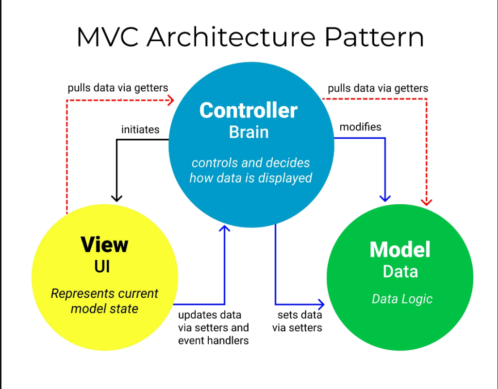

# Query parameters
thêm 1 lệnh get để log ra q (q: là thành phần tìm kiếm)
```js
app.get('/search', (req, res) => {
  console.log(req.query.q)
  res.render('search');
}) 
```
url http://localhost:3000/search?q=song%20nhu%20song%20nhu%20suoi
trả về 1 cái query

# Form 
tạo 1 form bằng bootstrap sau đó phân cái q có được
```js
<div method ="GET" action = "" class="mb-3">
```
action sẽ chuyển sang site đó vd /search

# POST 
nhét thêm 2 cái này vào
app.use(express.urlencoded)
app.use(express.json())
để có thể hiển thị được req.body
```js
app.post('/search', (req, res) => {
  console.log(req.body)
  res.send('');
}) 
```

# MVC
view: chứa phần html css thôi
model: tương tác với data source (database)
controller: trung chuyển
- web server: http
- route: định tuyến (get, post)
- dispatcher: thực thi,gọi sang controller



# [MVC] Routes & Controllers
Local host 
tạo folder routes, app\controllers
